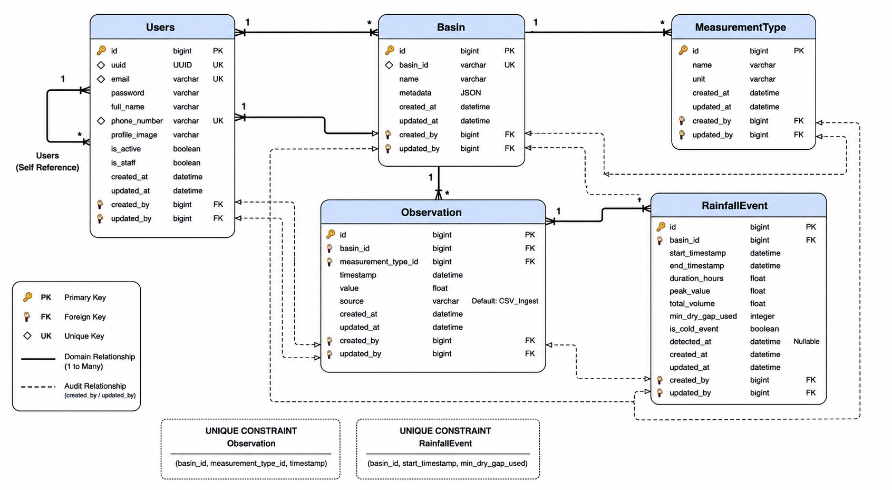
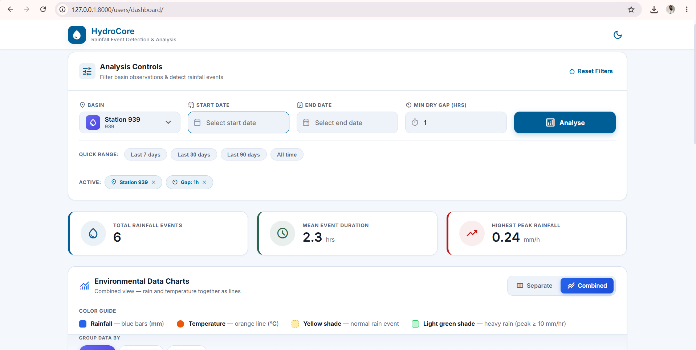
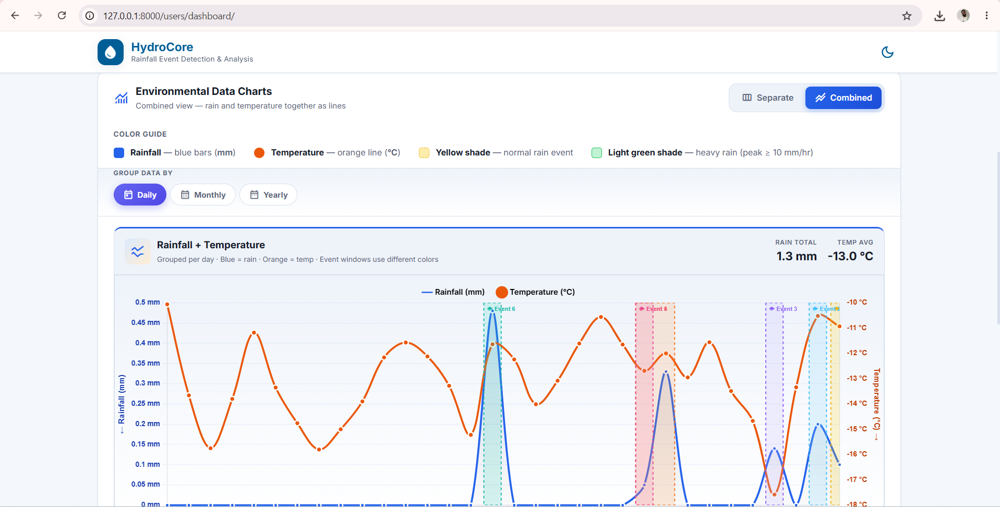
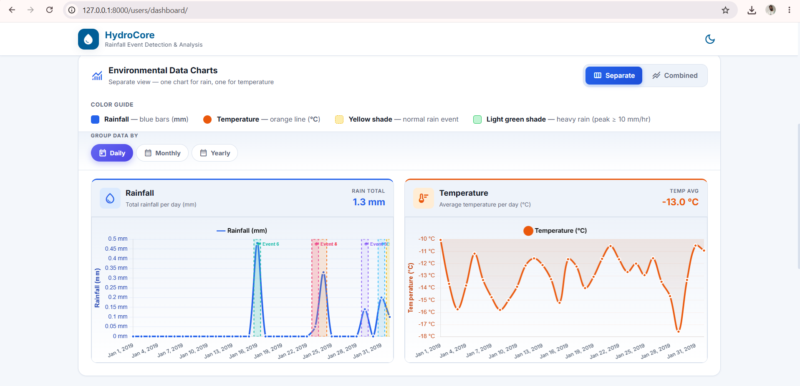
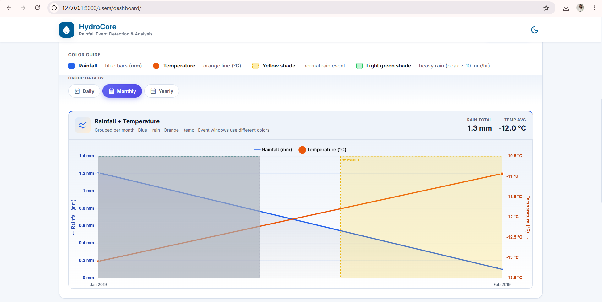
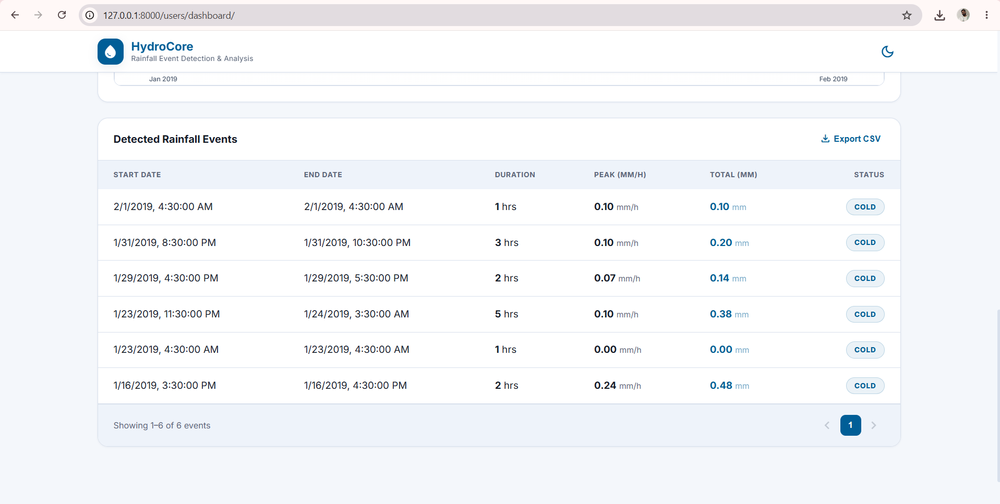

# Hydrocore — Setup & Usage Guide

A scalable Django REST Framework application for hydrological data management, rainfall event detection, analytics, and environmental monitoring.

Simple guide to install, run, and use the Hydrocore project.

---

## 1. What you need first

- Python 3.12+
- MySQL
- Redis
- Git

---

## 2. Project install

```bash
# create virtual environment
python -m venv venv

# activate (Windows)
.\venv\Scripts\Activate.ps1

# install packages
pip install -r requirements.txt
```

Create a `.env` file in the project root with your settings, for example:

```env
SECRET_KEY=""
DEBUG=True
ALLOWED_HOSTS="127.0.0.1,localhost"
DB_ENGINE="django.db.backends.mysql"
DB_NAME="hydrocore_db"
DB_USER="root"
DB_PASSWORD="yourpassword"
DB_HOST="127.0.0.1"
DB_PORT="3306"
SWAGGER_DEFAULT_API_URL="http://127.0.0.1:8000/"
REDIS_LOCATION="redis://127.0.0.1:6379/1"
```

Replace `SECRET_KEY`, `DB_PASSWORD`, and other values with your own.
---

## 3. Start Redis (required)

Caching needs Redis running.

**Windows (WSL / Ubuntu):**
```bash
sudo service redis-server start
redis-cli ping
```

**Docker:**
```bash
docker run -d -p 6379:6379 --name hydrocore-redis redis
```

If `redis-cli ping` returns `PONG`, Redis is ready.

---

## 4. Database migrations

```bash
python manage.py makemigrations
python manage.py migrate
```

Creates all tables (users, basins, measurement types, observations, rainfall events).

---

## 5. Create superuser (admin login)

```bash
python manage.py createsuperuser
```

---

## 6. Run the server

```bash
python manage.py runserver
```

Default base URL: `http://127.0.0.1:8000/`

---

## 7. Important URLs

### Page / UI URLs (no `/api` prefix)

| Page | URL |
|------|-----|
| Dashboard UI | http://127.0.0.1:8000/users/dashboard/ |
| Admin panel | http://127.0.0.1:8000/admin/ |
| Home (redirects to docs) | http://127.0.0.1:8000/ |

### API URLs (`/api/` prefix)

| Page | URL |
|------|-----|
| API docs (Swagger) | http://127.0.0.1:8000/api/docs/ |
| ReDoc | http://127.0.0.1:8000/api/docs/redoc/ |
| Users API | http://127.0.0.1:8000/api/users/ |
| Basins API | http://127.0.0.1:8000/api/basins/ |
| Observations API | http://127.0.0.1:8000/api/observations/ |
| Analytics API | http://127.0.0.1:8000/api/analytics/ |

### API documentation (Swagger / ReDoc)

No separate Postman collection or curl examples are required.

- Interactive docs: http://127.0.0.1:8000/api/docs/
- ReDoc: http://127.0.0.1:8000/api/docs/redoc/

Use Swagger to authorize with JWT and run all APIs directly from the browser.

### Users app routing

| Type | File | Mount | Example |
|------|------|-------|---------|
| Pages | `apps/users/urls.py` | `/users/` | `/users/dashboard/` |
| APIs | `apps/users/api/urls.py` | `/api/users/` | `/api/users/login/` |

---

## 8. Step-by-step project flow

### Step A — Register / Login (API)

Use `/api/users/...` for auth APIs.  
Use `/users/dashboard/` for the UI page.

**Register**
```
POST http://127.0.0.1:8000/api/users/register-user/
```

**Login**
```
POST http://127.0.0.1:8000/api/users/login/
Content-Type: application/json

{
  "email": "you@example.com",
  "password": "YourPassword"
}
```

Copy the `token` (access) and `refresh_token` from the response.  
Use the access token in other APIs as:

```
Authorization: Bearer <access_token>
```

**Logout** (expires both access and refresh tokens)

```
POST http://127.0.0.1:8000/api/users/logout/
Authorization: Bearer <access_token>
Content-Type: application/json

{
  "refresh_token": "<refresh_token_from_login>"
}
```

After logout:
- the **refresh token** is blacklisted (cannot get new access tokens)
- the **access token** is marked expired in Redis (cannot call protected APIs anymore)

---

### Step B — Create measurement types

You need two types before ingesting CSVs.

You can load them from the provided fixture:

```bash
python manage.py loaddata measurement_types.json
```

Or create them manually via the API:

```
POST http://127.0.0.1:8000/api/observations/create-or-update-measurement-type/
Authorization: Bearer <token>
Content-Type: application/json
```

**Rainfall**
```json
{ "name": "Rainfall", "unit": "mm" }
```

**Temperature**
```json
{ "name": "Temperature", "unit": "°C" }
```

List them:
```
GET http://127.0.0.1:8000/api/observations/get-measurement-types/
```

---

### Step C — Create a basin (optional)

Ingestion can auto-create basins from CSV station IDs.  
You can also create one manually:

```
POST http://127.0.0.1:8000/api/basins/create-or-update-basin/
Authorization: Bearer <token>
Content-Type: application/json

{
  "name": "Station 2046",
  "metadata": {}
}
```

List basins:
```
GET http://127.0.0.1:8000/api/basins/get-basins/
```

---

### Step D — Ingest CSV files

#### Option 1 — Management command (recommended for large files)

```bash
python manage.py ingest_observations ^
  --rainfall "C:\path\to\your\local\january_data_rain.csv" ^
  --temperature "C:\path\to\your\local\january_data_temp.csv"
```

Replace the example paths above with the actual local file paths on your machine.

#### Option 2 — API upload

```
POST http://127.0.0.1:8000/api/observations/ingest/
Authorization: Bearer <token>
Content-Type: multipart/form-data
```

Form fields:
- `rainfall_file` = `january_data_rain.csv`
- `temperature_file` = `january_data_temp.csv`
- `auto_create_basins` = `true`

Success response shape:

```json
{
  "status": true,
  "status_code": 200,
  "message": "Successfully created.",
  "data": {},
  "errors": []
}
```

On failure, status codes stay the same and `errors` becomes a list:

```json
{
  "status": false,
  "status_code": 400,
  "message": "Invalid datetime: 'bad-date'",
  "data": {},
  "errors": [
    {
      "row": 12,
      "function": "_parse_timestamp",
      "line": 240,
      "error": "Invalid datetime: 'bad-date'"
    }
  ]
}
```

---

### Step E — Detect rainfall events

```
POST http://127.0.0.1:8000/api/basins/{basin_pk}/detect-events/?min_dry_gap_hours=6
Authorization: Bearer <token>
Content-Type: application/json

{
  "measurement_id": 1
}
```

`measurement_id` = Rainfall measurement type id.

Same detect endpoint is also available under analytics:

```
POST /api/analytics/basins/{basin_pk}/detect-events/?min_dry_gap_hours=6
```

---

### Step F — View timeseries / events / summary

PDF-style basin routes (`/api/basins/`):

```
GET /api/basins/{basin_pk}/timeseries/?measurement_type=rainfall&from=2026-01-01&to=2026-01-31
GET /api/basins/{basin_pk}/events/?min_dry_gap_used=6&min_total_volume=10
GET /api/basins/{basin_pk}/event-summary/?min_dry_gap_hours=6
GET /api/basins/{basin_pk}/event-comparison/?gaps=3,6,12
```

Analytics equivalents:

```
GET /api/analytics/basins/{basin_pk}/timeseries/?measurement_type=rainfall&from=2026-01-01&to=2026-01-31
GET /api/analytics/basins/{basin_pk}/events/?min_dry_gap_used=6&min_total_volume=10
GET /api/analytics/basins/{basin_pk}/event-summary/?min_dry_gap_hours=6
GET /api/analytics/basins/{basin_pk}/event-comparison/?gaps=3,6,12
```

Event detail timeseries (analytics route):

```
GET /api/analytics/events/{event_id}/timeseries/
```

---

### Step G — Open dashboard (page URL)

```
http://127.0.0.1:8000/users/dashboard/
```

This is a **page URL** from `apps/users/urls.py` (not under `/api/`).

1. Select a basin  
2. Choose start / end date (not mandatory)  
3. Set dry gap (default 6)  
4. Click Analyse  
5. See charts, event table, and summary cards  

---

## 9. Useful URL list

### Page URLs

| Action | Method | URL |
|--------|--------|-----|
| Dashboard UI | GET | `/users/dashboard/` |

### API URLs

| Action | Method | URL |
|--------|--------|-----|
| Login | POST | `/api/users/login/` |
| Logout | POST | `/api/users/logout/` |
| Register | POST | `/api/users/register-user/` |
| List users | GET | `/api/users/get-users/` |
| Create/update user | POST | `/api/users/create-or-update-user/` |
| Delete users | DELETE | `/api/users/delete/` |
| Create basin | POST | `/api/basins/create-or-update-basin/` |
| List basins | GET | `/api/basins/get-basins/` |
| Create measurement type | POST | `/api/observations/create-or-update-measurement-type/` |
| Ingest CSV | POST | `/api/observations/ingest/` |
| Detect events | POST | `/api/basins/{id}/detect-events/` |
| Basin timeseries | GET | `/api/basins/{id}/timeseries/?measurement_type=rainfall&from=...&to=...` |
| Basin event list | GET | `/api/basins/{id}/events/` |
| Event summary | GET | `/api/basins/{id}/event-summary/` |
| Event comparison | GET | `/api/basins/{id}/event-comparison/?gaps=3,6,12` |
| Event detail timeseries | GET | `/api/analytics/events/{id}/timeseries/` |

Try these endpoints in Swagger:

- http://127.0.0.1:8000/api/docs/
- http://127.0.0.1:8000/api/docs/redoc/

---

## 10. Sample ingestion run logs

Command:

```bash
python manage.py ingest_observations ^
  --rainfall "C:\path\to\your\local\january_data_rain.csv" ^
  --temperature "C:\path\to\your\local\january_data_temp.csv"
```

Sample successful run:

```text
Ingesting rainfall: D:\amrita\Data\january_data_rain.csv
[ingest] ingest_rainfall started
[ingest] rainfall: parsing CSV started
[ingest] rainfall: parsed 25,000 rows...
[ingest] rainfall: parsing CSV ended — 29,760 rows
[ingest] rainfall: loading measurement type + basins started
[ingest] rainfall: basins ready — 8 stations
[ingest] rainfall: building observation objects started
[ingest] rainfall: built 25,000 / 29,760 objects...
[ingest] rainfall: building observation objects ended
[ingest] rainfall: bulk_create started (29,760 rows)
[ingest] rainfall: bulk_create ended
[ingest] rainfall: cache invalidation started
[ingest] rainfall: cache invalidation ended
[ingest] rainfall: completed successfully in 12.45s
[ingest] ingest_rainfall ended

Ingesting temperature: D:\amrita\Data\january_data_temp.csv
[ingest] ingest_temperature started
[ingest] temperature: parsing CSV started
[ingest] temperature: parsed 25,000 rows...
[ingest] temperature: parsed 50,000 rows...
[ingest] temperature: parsed 75,000 rows...
[ingest] temperature: parsed 100,000 rows...
[ingest] temperature: parsing CSV ended — 502,200 rows
[ingest] temperature: loading measurement type + basins started
[ingest] creating 3 missing basins...
[ingest] temperature: basins ready — 12 stations
[ingest] temperature: building observation objects started
[ingest] temperature: bulk_create started (502,200 rows)
[ingest] temperature: bulk_create ended
[ingest] temperature: cache invalidation started
[ingest] temperature: cache invalidation ended
[ingest] temperature: completed successfully in 96.80s
[ingest] ingest_temperature ended

Successfully created.
```

Sample failure (stops on first bad row):

```text
[ingest] ingest_rainfall started
[ingest] rainfall: parsing CSV started
[ingest] rainfall: FAILED — Invalid datetime: 'bad-date'
CommandError: Invalid datetime: 'bad-date'
```

---

## 11. Event detection algorithm

Simple explanation of how Hydrocore finds rainfall events.

### What is a rainfall event?

A rainfall event is a **group of rainy hours** that belong together.

Rainy hour = rainfall value `> 0`  
Dry hour = rainfall value `= 0`

Two rain bursts become **separate events** only when the dry gap between them is long enough.

### The dry-gap rule

You choose `min_dry_gap_hours` (default example: `6`).

| Situation | Result |
|-----------|--------|
| Rain → few dry hours (less than gap) → rain again | **Same event** (merged) |
| Rain → dry hours >= gap → rain again | **Two events** |

Example with gap = 6:

```
Rain Rain 0 0 0 0 Rain     → still one event (only 4 dry hours)
Rain Rain 0 0 0 0 0 0 Rain → two events (6 dry hours)
```

Example with gap = 3:

```
Rain Rain 0 0 Rain         → still one event (only 2 dry hours)
Rain Rain 0 0 0 Rain       → two events (3 dry hours)
```

### Algorithm style

Hydrocore uses a **state machine** (scan hour by hour).

**Steps**

1. Load hourly rainfall for one basin (ordered by time)
2. Aggregate values to exact hours if needed
3. Walk from first hour to last hour
4. Keep these state values:
   - `current_start` — when the open event began
   - `last_non_zero` — last rainy hour
   - `total_volume` — sum of rain in event
   - `peak_value` — max rain in event
   - `dry_streak` — consecutive dry hours

**Rules while scanning**

If value > 0 (rain):
- If no event open → start new event
- Add value to volume
- Update peak if higher
- Reset dry streak to 0

If value = 0 (dry):
- If an event is open → increase dry streak
- If dry streak >= `min_dry_gap_hours` → **close the event** at `last_non_zero`

At end of scan:
- If an event is still open → close it

### What we save for each event

| Field | Meaning |
|-------|---------|
| `start_timestamp` | First rainy hour |
| `end_timestamp` | Last rainy hour |
| `duration_hours` | Hours from start to end (inclusive) |
| `peak_value` | Highest hourly rain (mm/hr) |
| `total_volume` | Sum of hourly rain (mm) |
| `min_dry_gap_used` | Gap setting used for this run |
| `is_cold_event` | True if mean temperature in window is below 0°C |
| `detected_at` | When detection saved this event |

### Idempotent re-detection

Before saving new events for a basin + gap:

1. Delete old events with same `basin` + `min_dry_gap_used`
2. Insert newly detected events

So running detect twice does **not** double the events.

### API used

```
POST /api/basins/{basin_id}/detect-events/?min_dry_gap_hours=6
```

Also available:

```
POST /api/analytics/basins/{basin_id}/detect-events/?min_dry_gap_hours=6
```

Body example:

```json
{ "measurement_id": 1 }
```

Response includes:
- `total_events`
- `scanned_from`
- `scanned_to`
- `min_dry_gap_hours`

### Small examples (gap = 6)

**Example 1 — one simple event**
```
1, 2, 3, 0, 0, 0, 0, 0, 0
```
Gap = 6 → **1 event** (1–3)

**Example 2 — two events**
```
1, 2, 0, 0, 0, 0, 0, 0, 4, 5
```
Gap = 6 → **2 events** (1–2 and 4–5)

**Example 3 — merged event**
```
1, 2, 0, 0, 0, 3, 4
```
Gap = 6 → **1 event** (dry gap only 3 hours)

### Small examples (gap = 3)

**Example 1 — one simple event**
```
1, 2, 3, 0, 0, 0
```
Gap = 3 → **1 event** (1–3)

**Example 2 — two events**
```
1, 2, 0, 0, 0, 4, 5
```
Gap = 3 → **2 events** (1–2 and 4–5)

**Example 3 — merged event**
```
1, 2, 0, 0, 3, 4
```
Gap = 3 → **1 event** (dry gap only 2 hours)

### Why this algorithm?

- Easy to understand
- Matches the exam definition exactly
- Works well with ordered hourly data
- Easy to explain in README / interview

---

## 12. Data model design choices

Simple explanation of why the database models look the way they do.

### Main models

1. **Basin** — a river basin / gauging station  
2. **MeasurementType** — Rainfall or Temperature  
3. **Observation** — one hourly reading  
4. **RainfallEvent** — one detected rain event  
5. **Users** — login and ownership fields  

### Why separate Basin?

CSV files use station IDs like `2046`, `939`.

We store:

- `basin_id` = station code from CSV (`"2046"`)
- `name` = friendly name
- `metadata` = extra JSON info

This keeps station identity clear and reusable for rain + temperature.

### Why MeasurementType table?

Rain and temperature are different units:

- Rainfall → `mm`
- Temperature → `°C`

Instead of hardcoding, we keep a small lookup table.  
Then Observation points to the type.

Benefits:
- Easy to add new types later
- Same Observation table for all measurements

### Why Observation is the core table?

Every CSV row becomes one Observation:

| Field | Example |
|-------|---------|
| basin | Station 2046 |
| measurement_type | Rainfall |
| timestamp | 2019-01-01 01:00:00 |
| value | 0.24 |
| source | CSV_Ingest |

**Unique rule:** `(basin, measurement_type, timestamp)` must be unique.

Why?
- Re-ingesting same CSV should not create duplicates
- One value per basin / type / hour

**Index:** `(basin, measurement_type, timestamp)`

Why?
- Event detection reads full ordered sequences
- Timeseries API filters by basin + type + date range
- Index makes these queries much faster

### Why RainfallEvent is a separate table?

We do **not** store events only in memory.

Detected events are saved with:

- start / end
- duration
- peak
- total volume
- dry gap used
- `detected_at`
- cold-event flag

Why separate table?
- Fast listing and filtering of events
- Dashboard event table is simple
- Re-detection can delete/recreate cleanly
- Summary APIs can aggregate from SQL

**Unique rule:** `(basin, start_timestamp, min_dry_gap_used)`

Why?
- Same start can exist for different gap settings (3 vs 6 vs 12)
- Same gap should not store duplicate starts

### Why include `min_dry_gap_used` on the event?

Because event shape depends on the gap setting.

Example:
- Gap = 3 → more small events
- Gap = 12 → fewer merged events

We store which gap created each event, so filters and summaries stay correct.

### Why `detected_at`?

Marks when the detection process created/observed the event row.  
This matches the exam RainfallEvent entity field list.

### Why `is_cold_event`?

Bonus logic:

If mean temperature during the rain event is below `0°C`, mark it as a cold event (possible snow/ice risk).

Detection computes this from Temperature observations in the same event window.

### Why created_by / updated_by / timestamps?

Almost all models inherit common audit fields:

- `created_at`
- `updated_at`
- `created_by`
- `updated_by`

Why?
- Know who uploaded or changed data
- Useful for admin and debugging

### Design summary

| Choice | Reason |
|--------|--------|
| Separate Basin | Clear station identity |
| MeasurementType lookup | Flexible units/types |
| Observation uniqueness | Idempotent ingest |
| Composite index | Fast detection/timeseries |
| RainfallEvent table | Persist computed events |
| Store dry gap on event | Correct filtering by algorithm setting |
| `detected_at` | Exam entity field + detection time |
| `is_cold_event` | Cold-rain / ice-risk bonus flag |

This design keeps raw data and computed events clean and separate.

---

## 13. Redis cache strategy

Simple explanation of how Hydrocore uses Redis.

### Why Redis?

Some APIs are heavy:

- timeseries for many hours
- event lists
- event summaries

Without cache, every request hits MySQL.  
With Redis, repeated reads are much faster.

### Cache backend

Django uses `django-redis`.

Default location:
```
redis://127.0.0.1:6379/1
```

Set in `.env` as:
```
REDIS_LOCATION=redis://127.0.0.1:6379/1
```

Helper class: `utils/cache.py` → `CacheManager`

### Cache key strategy

Keys are built from request filters so each unique query has its own cache entry.

**1) Timeseries**
```
basin:{basin_id}:timeseries:{measurement_type_id}:{start}:{end}
```

Example:
```
basin:5:timeseries:1:2019-01-01:2019-01-31
```

**2) Event list**
```
basin:{basin_id}:events:{min_dry_gap}:{min_total_volume}:{start}:{end}:{search}:{id}
```

**3) Event summary**
```
basin:{basin_id}:event-summary:{min_dry_gap_hours}
```

Example:
```
basin:5:event-summary:6
```

**Pattern used for clear-all-by-basin**
```
basin:{basin_id}:*
```

### TTL (expiry)

Default timeout: **3600 seconds (1 hour)**

After expiry, next request loads fresh data from MySQL and stores it again.

### How get_or_set works

1. Check Redis for key  
2. If found → return cache data (**CACHE HIT**)  
3. If missing → query MySQL, save to Redis, return data (**CACHE MISS**)

Terminal logs look like:
```
[CACHE HIT]  Successfully retrieved data for key '...' from Redis.
[CACHE MISS]  Fetching data for key '...' from the Database.
```

### Cache invalidation

Stale cache is dangerous.  
If data changes, old cache must be removed.

**When we invalidate**

| Action | Why invalidate |
|--------|----------------|
| New observation created/updated | Timeseries changed |
| CSV ingest finished | Many observations changed |
| Detect-events run | Events deleted/recreated |

**How we invalidate**

```python
CacheManager.invalidate_basin_cache(basin_id)
```

This deletes all keys matching:
```
basin:{basin_id}:*
```

So timeseries + events + summary for that basin are cleared together.

### Simple flow

```
API request
   ↓
Build cache key
   ↓
Redis has key? ──yes──→ return cached JSON
   │
   no
   ↓
Query MySQL
   ↓
Save to Redis (TTL 1 hour)
   ↓
Return JSON
```

When data changes:
```
Write happens (ingest / detect / update)
   ↓
invalidate_basin_cache(basin_id)
   ↓
Next read rebuilds fresh cache
```

### Why this design is good

- Keys are readable and predictable  
- One basin invalidation clears related keys  
- Heavy read endpoints become fast  
- Fresh data after ingest/detection  

### Remember

Redis must be running before you use the app in production/dev with caching enabled.

```bash
redis-cli ping
# expected: PONG
```

---

## 14. ER diagram screenshot

Full ER diagram screenshot (entities, fields, relationships):



---

## 15. Dashboard screenshots

Dashboard URL: http://127.0.0.1:8000/users/dashboard/

### Full dashboard UI (station selector, date range, gap control)



### Timeseries chart with detected events shaded

Combined view (rain + temperature) with event windows colored differently:



Separate view (rainfall line chart + temperature chart):



Monthly grouping with shaded event region:



### Event table with real detected events



---

## 16. Run tests

```bash
python -m pytest
```

---

## 17. Celery ingest jobs (design guide, not implemented)

How Celery should work with the **ingest API** and the **`ingest_jobs`** control table.

This section is a design guide. It describes the target flow; Celery code may still need to be implemented separately.

### Big idea (simple)

1. Client calls **ingest API**
2. API **creates one row** in `ingest_jobs` for that request (stores all details)
3. API returns response with that job info (**does not run heavy ingest yet**)
4. **Every 1 minute**, Celery looks for jobs with status **`pending`**
5. For each pending job:
   - status → **`in_queue`**
   - worker starts → status → **`started`**
   - runs the **common ingest function** (`IngestionService`)
   - if OK → status → **`completed`**
   - if error → status → **`failed`** (recommended)

One API call = **one `ingest_jobs` object**.  
That object’s status is updated step by step until it finishes.

### Status flow (per job object)

```
API creates job
      │
      ▼
  pending          ← waiting in DB
      │
      │  Celery Beat (every 1 minute) picks this job
      ▼
  in_queue         ← claimed / sent to worker
      │
      │  Worker picks the job
      ▼
  started          ← ingest function is running
      │
      ├──────────────►  completed   ← success
      │
      └──────────────►  failed      ← error (store message)
```

| Status | When it is set | Who sets it |
|--------|----------------|-------------|
| `pending` | Right after ingest API creates the row | API |
| `in_queue` | When the minute-job claims this pending row | Celery Beat / dispatcher |
| `started` | When worker begins running ingest | Celery Worker |
| `completed` | When common ingest function finishes OK | Celery Worker |
| `failed` | When ingest raises an error | Celery Worker |

Each object in `ingest_jobs` follows this path independently.

### What happens when ingest API is called

**Endpoint**

```http
POST /api/observations/ingest/
Authorization: Bearer <token>
Content-Type: multipart/form-data
```

Form fields:

- `rainfall_file` (optional)
- `temperature_file` (optional)
- `auto_create_basins` (optional, default true)

**API steps (target design)**

1. Validate request (at least one CSV, `.csv` only, etc.)
2. Save uploaded file(s) to disk (e.g. `media/ingest_jobs/<uuid>/`)
3. **Create one `ingest_jobs` object** with:
   - all file paths / names
   - `auto_create_basins`
   - `job_type` (`rainfall` / `temperature` / `both`)
   - `created_by`
   - **`status = pending`**
4. Return API response including that job’s id / uuid / status  
   (HTTP **202 Accepted** is a good fit)

**Example API response**

```json
{
  "status": true,
  "status_code": 202,
  "message": "Ingest job created. It will run when pending jobs are processed.",
  "data": {
    "job_id": 15,
    "job_uuid": "a1b2c3d4-....",
    "job_status": "pending",
    "job_type": "both"
  },
  "errors": []
}
```

**Important:** The API does **not** call `IngestionService` here.  
It only **creates the control object** and returns.

### What lives in `ingest_jobs` (one row per API call)

| Field | Stored from API call |
|-------|----------------------|
| `job_uuid` | New unique id |
| `job_type` | rainfall / temperature / both |
| `status` | starts as `pending` |
| `rainfall_file` | saved path (if uploaded) |
| `temperature_file` | saved path (if uploaded) |
| `rainfall_original_name` | original filename |
| `temperature_original_name` | original filename |
| `auto_create_basins` | from request |
| `created_by` | logged-in user |
| `celery_task_id` | filled later when queued |
| `error_message` | filled only on failure |
| `started_at` / `completed_at` | filled by worker |

**API call → create object in `ingest_jobs` → that object is the source of truth for this ingest request.**

### Every minute: process pending jobs

Celery Beat runs **once every minute**.

**Dispatcher task (every minute)**

For all (or a batch of) rows where `status = pending`:

1. Change that object: **`pending` → `in_queue`**
2. Send worker task for that object: `run_ingest_job(job_id)`
3. Save `celery_task_id` on the object

Example batch: take up to 10 pending jobs per minute so one minute does not overload the worker.

**Worker task (per object)**

For **each** job object:

1. Change status: **`in_queue` → `started`**
2. Set `started_at`
3. Run the **common ingest function(s)**:
   - if rainfall file exists → `IngestionService.ingest_rainfall(...)`
   - if temperature file exists → `IngestionService.ingest_temperature(...)`
4. On success:
   - status → **`completed`**
   - set `completed_at`
5. On error:
   - status → **`failed`**
   - save `error_message`

Same common ingest code as today — Celery only controls **when** it runs and **updates status** on the `ingest_jobs` row.

### End-to-end example

| Time | Event | `ingest_jobs.status` |
|------|--------|----------------------|
| 10:00:05 | User calls ingest API | row created → `pending` |
| 10:00:05 | API returns job_id=15 | still `pending` |
| 10:01:00 | Beat finds job 15 | `pending` → `in_queue` |
| 10:01:01 | Worker starts job 15 | `in_queue` → `started` |
| 10:01:45 | Ingest finishes OK | `started` → `completed` |

If another user calls ingest at 10:00:20, that creates **another** row (job 16), also `pending`.  
At 10:01:00 Beat can claim **both** pending objects; each goes `in_queue` → `started` → `completed` separately.

### Common ingest function (do not duplicate)

Worker should call existing service methods only:

```text
IngestionService.ingest_rainfall(file, auto_create_basins=..., created_by=...)
IngestionService.ingest_temperature(file, auto_create_basins=..., created_by=...)
```

Celery / `ingest_jobs` only:

- store request details
- drive status: pending → in_queue → started → completed
- decide **when** to run

### Optional: check job status later

```http
GET /api/observations/ingest-jobs/{job_id}/
Authorization: Bearer <token>
```

Returns the same object’s current status (`pending` / `in_queue` / `started` / `completed` / `failed`).

### How to run (after code is implemented)

```bash
# 1) Redis must be running

# 2) Django API
python manage.py runserver

# 3) Celery worker (runs ingest, updates started/completed)
celery -A hydrocore worker -l info

# 4) Celery Beat (every minute: pending → in_queue)
celery -A hydrocore beat -l info
```

| Process | Role in this flow |
|---------|-------------------|
| API | Creates `ingest_jobs` object as `pending` |
| Beat | Each minute: pending → in_queue + enqueue worker |
| Worker | Each object: started → run ingest → completed/failed |

### Files needed when implementing (reference)

| Piece | Purpose |
|-------|---------|
| `IngestJob` model / `ingest_jobs` table | One object per ingest API call |
| Ingest API change | Create pending object + return it |
| `IngestJobService` | create / claim pending / execute + update status |
| Celery Beat task | Every minute process `pending` |
| Celery Worker task | Per object: started → common ingest → completed |
| `hydrocore/celery.py` + settings | Celery app + 60s schedule |
| `celery` in `requirements.txt` | Dependency |

Suggested Redis split:

- Cache (existing): `redis://127.0.0.1:6379/1`
- Celery broker: `redis://127.0.0.1:6379/0`

### Short summary

| Step | Action | Status on that `ingest_jobs` object |
|------|--------|-------------------------------------|
| 1 | Ingest API called | Create object → **`pending`** |
| 2 | Every minute Beat runs | That object → **`in_queue`** |
| 3 | Worker starts | That object → **`started`** |
| 4 | Common ingest function finishes | That object → **`completed`** (or **`failed`**) |

**API creates objects. Celery updates their status and runs the common ingest function.**

---

## Quick checklist

1. Install packages  
2. Configure `.env` (MySQL + Redis)  
3. Start Redis  
4. Run migrations  
5. Create superuser  
6. Load measurement types: `python manage.py loaddata measurement_types.json`  
7. Start server  
8. Open `/api/docs/` and `/api/docs/redoc/` for API documentation  
9. Login → create measurement types → ingest CSVs → detect events → open dashboard  
